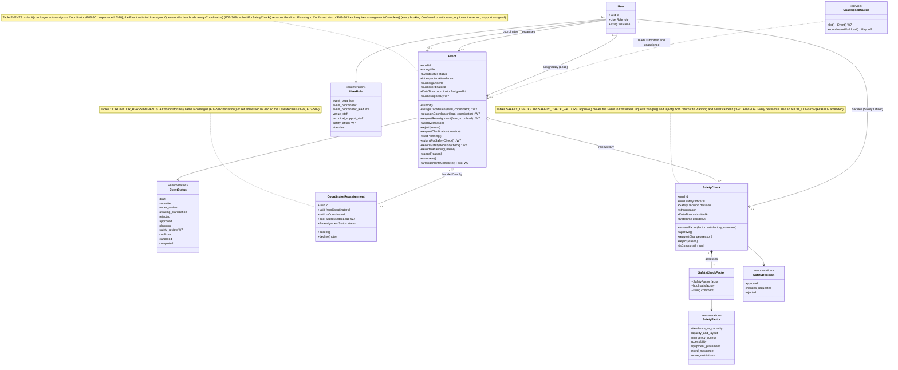

## Class diagram — venue booking and event lifecycle after the Week 7 Customer Changes

Version 1 · 3 October 2026

The Week 7 "Managing Changes" guide asks for a class diagram alongside the ERD and the
C4 views, so that a change to a rule can be traced to the object that owns it. This
diagram covers the two domains the six Customer Changes touch: venue booking
(C-65 to C-68) and the event lifecycle (C-69, C-70). It is a domain model of the
`Event Lifecycle` and `Venue Management` components in `docs/c4-diagrams.md`, not a
transcript of the TypeScript modules; where a class maps to a table in
`docs/db_schema.md` the table is named in a note. Attributes and operations added or
changed by Week 7 are marked `W7`.

### Venue booking

```mermaid
classDiagram
    direction LR

    class Venue {
        +uuid id
        +string name
        +string location
        +int maxCapacity
        +int setupMinutes W7
        +int turnaroundMinutes W7
        +Time opensAt
        +Time closesAt
        +bool isActive
        +occupancyWindow(range) Range W7
        +isFree(range) bool W7
        +recordUnavailability(range, category, note) VenueBlock W7
        +retire()
    }

    class VenueBooking {
        +uuid id
        +Range bookingRange
        +Range occupancyRange W7
        +BookingStatus status
        +string purpose W7
        +int headcount W7
        +bool isPrimary W7
        +DateTime expiresAt W7
        +DateTime reminderSentAt W7
        +bool requiresReconfirmation
        +string decisionReason
        +requestBooking()
        +confirm(decidedBy)
        +reject(decidedBy, reason, suggestedVenue)
        +release()
        +markConflicting(reason) W7
        +expire() W7
        +extend(newExpiry, by) W7
        +convertHoldToRequest() W7
    }

    class VenueBlock {
        +uuid id
        +Range blockRange
        +UnavailabilityReason reasonCategory W7
        +string reason
        +shorten(newRange)
        +remove()
    }

    class BookingStatus {
        <<enumeration>>
        pending
        tentative W7
        confirmed
        rejected
        released
        conflicting
        expired W7
    }

    class UnavailabilityReason {
        <<enumeration>>
        maintenance
        equipment_failure
        renovation
        safety_concern
        other
    }

    class HoldExpiryJob {
        <<service>>
        +run(now) W7
        +expireDueHolds(now)
        +sendDueReminders(now)
    }

    Venue "1" o-- "0..*" VenueBooking : hosts
    Venue "1" o-- "0..*" VenueBlock : unavailableDuring
    VenueBooking --> BookingStatus
    VenueBlock --> UnavailabilityReason
    HoldExpiryJob ..> VenueBooking : expires and reminds
    VenueBooking "0..1" --> "0..1" Venue : suggestedVenue on rejection

    note for Venue "Table VENUES. occupancyWindow() widens a range by setupMinutes before and turnaroundMinutes after; every availability, search and conflict check uses it (C-65, E05-S05 Scenarios 2 and 7). recordUnavailability() marks overlapping Pending or Confirmed bookings Conflicting instead of refusing (C-66, E05-S06)."
    note for VenueBooking "Table VENUE_BOOKINGS. occupancyRange is filled on write and is what the EXCLUDE constraint keys on (ADR-003 amended). Several bookings per Event are allowed; purpose, headcount and isPrimary are per booking (C-67). tentative holds carry expiresAt and are expired by HoldExpiryJob (C-68)."
    note for HoldExpiryJob "Runs inside the Scheduler and Outbox Relay poll (ADR-006 amended, T-69). Both operations are idempotent: status and reminderSentAt are the guards."
```

### Event lifecycle

### Reading the two diagrams together

- A `VenueBooking` belongs to exactly one `Event`; from Week 7 an `Event` may own
  several, so `Event.arrangementsComplete()` iterates its bookings rather than
  reading a single one (C-67, E08-S03).
- `Event.submitForSafetyCheck()` is the only transition that creates a
  `SafetyCheck`; `SafetyCheck.approve()` is the only path to `confirmed` once the
  migration lands (T-71). The `Safety Review` status is the team's interim answer to
  O-39 and may be renamed or folded into `Planning` after the customer Q&A.
- `HoldExpiryJob` and `UnassignedQueue` are stereotyped `<<service>>` because they
  own no state of their own; both read and write through the classes they point at.

### Change log

- v1 (3 October 2026): first version, created for the Week 7 Customer Changes. Covers
  venue booking and the event lifecycle only; equipment, registration and
  notification classes are out of scope until a change touches them.
