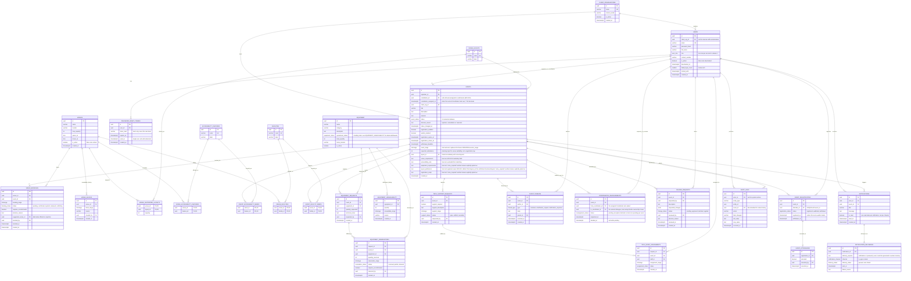

## Database schema

```mermaid
erDiagram
    CLIENT_ORGANISATIONS ||--o{ USERS : "employs"
    CLIENT_ORGANISATIONS ||--o{ EVENTS : "owns"
    USERS ||--o{ PASSWORD_RESET_TOKENS : "has"
    USERS ||--o{ EVENTS : "organises_or_coordinates"

    EVENTS ||--o{ VENUE_BOOKINGS : "booked_for"
    VENUES ||--o{ VENUE_BOOKINGS : "hosts"
    VENUES ||--o{ VENUE_BLOCKS : "unavailable_during"
    VENUES ||--|{ VENUE_SUPPORTED_LAYOUTS : "supports"
    ROOM_LAYOUTS ||--o{ VENUE_SUPPORTED_LAYOUTS : "offered_as"
    ROOM_LAYOUTS ||--o{ EVENTS : "required_by"

    VENUES ||--o{ VENUE_ACCESSIBILITY_FEATURES : "provides"
    ACCESSIBILITY_FEATURES ||--o{ VENUE_ACCESSIBILITY_FEATURES : "offered_as"
    EVENTS ||--o{ EVENT_ACCESSIBILITY_NEEDS : "requires"
    ACCESSIBILITY_FEATURES ||--o{ EVENT_ACCESSIBILITY_NEEDS : "needed_as"

    VENUES ||--o{ VENUE_FACILITIES : "offers"
    FACILITIES ||--o{ VENUE_FACILITIES : "offered_as"
    EVENTS ||--o{ EVENT_FACILITY_NEEDS : "requires"
    FACILITIES ||--o{ EVENT_FACILITY_NEEDS : "needed_as"

    EVENTS ||--o{ EQUIPMENT_REQUESTS : "needs"
    EQUIPMENT ||--o{ EQUIPMENT_REQUESTS : "requested_as"
    EQUIPMENT_REQUESTS ||--o{ EQUIPMENT_RESERVATIONS : "fulfilled_by"
    EQUIPMENT ||--o{ EQUIPMENT_RESERVATIONS : "allocated_as"
    EQUIPMENT ||--o{ EQUIPMENT_UNAVAILABILITY : "withdrawn_during"

    EVENTS ||--o{ TECH_SUPPORT_REQUESTS : "requires"
    TECH_SUPPORT_REQUESTS ||--o{ TECH_STAFF_ASSIGNMENTS : "staffed_by"
    USERS ||--o{ TECH_STAFF_ASSIGNMENTS : "assigned_to"

    EVENTS ||--o{ EVENT_REGISTRATIONS : "admits"
    USERS ||--o{ EVENT_REGISTRATIONS : "registers"
    EVENT_REGISTRATIONS ||--o| EVENT_ATTENDANCE : "recorded_as"

    EVENTS ||--o{ EVENT_THREADS : "discussed_in"
    USERS ||--o{ EVENT_THREADS : "authors"
    EVENTS ||--o{ COORDINATOR_REASSIGNMENTS : "handed_over_by"
    USERS ||--o{ COORDINATOR_REASSIGNMENTS : "requests_or_receives"
    EVENTS ||--o{ CHANGE_REQUESTS : "amended_by"
    USERS ||--o{ CHANGE_REQUESTS : "raises"

    USERS ||--o{ NOTIFICATIONS : "receives"
    NOTIFICATIONS ||--|{ NOTIFICATION_DELIVERIES : "delivered_via"
    EVENTS ||--o{ NOTIFICATIONS : "triggers"
    USERS ||--o{ AUDIT_LOGS : "performs"
    EVENTS ||--o{ AUDIT_LOGS : "tracked_by"

    CLIENT_ORGANISATIONS {
        uuid id PK
        varchar name UK
        varchar contact_email
        boolean is_active
        timestamptz created_at
    }

    USERS {
        uuid id PK
        uuid client_org_id FK "null for internal staff and attendees"
        varchar email UK
        varchar password_hash
        varchar full_name
        user_role role "one role per account in release 1"
        varchar contact_number
        boolean is_active "false once deactivated"
        timestamptz deactivated_at
        smallint failed_login_count "lockout at 5"
        timestamptz locked_until
        timestamptz created_at
    }

    PASSWORD_RESET_TOKENS {
        uuid id PK
        uuid user_id FK
        varchar token_hash "hash only, never the raw token"
        timestamptz expires_at
        timestamptz used_at "single use; null until redeemed"
        timestamptz created_at
    }

    EVENTS {
        uuid id PK
        uuid organiser_id FK
        uuid coordinator_id FK "null until auto-assigned on submission (E03-S01)"
        timestamptz coordinator_assigned_at "when the current Coordinator took over; T-14 tie-break"
        uuid client_org_id FK
        varchar title
        text description
        text purpose
        event_status status "10 canonical statuses"
        text decision_reason "rejection, cancellation or reversion"
        timestamptz status_changed_at
        boolean registration_enabled
        boolean waitlist_enabled
        timestamptz registration_opens_at
        timestamptz registration_closes_at
        timestamptz withdrawal_deadline
        tstzrange event_range "start and end, replaces the former SESSIONS.session_range"
        int expected_attendance "planning input for venue suitability, not a registration cap"
        uuid layout_id FK "shared vocabulary with venue layouts"
        text venue_requirements "free text, E02-S01 mandatory field"
        text accessibility_note "free text, excluded from matching"
        text equipment_requirements "free text; 'none_required' sentinel means explicitly opted out"
        text layout_preference "free text organiser input, E02-S01; distinct from layout_id, the confirmed structured layout; 'none_required' sentinel means explicitly opted out"
        text registration_setup "free text; 'none_required' sentinel means explicitly opted out"
        timestamptz created_at
    }

    VENUES {
        uuid id PK
        varchar name
        varchar location
        int max_capacity
        time opens_at
        time closes_at
        boolean is_active "false once retired"
        timestamptz created_at
    }

    ROOM_LAYOUTS {
        uuid id PK
        varchar code UK
        varchar label
    }

    VENUE_SUPPORTED_LAYOUTS {
        uuid venue_id PK,FK
        uuid layout_id PK,FK
        int capacity
    }

    ACCESSIBILITY_FEATURES {
        uuid id PK
        varchar code UK
        varchar label
    }

    VENUE_ACCESSIBILITY_FEATURES {
        uuid venue_id PK,FK
        uuid feature_id PK,FK
    }

    EVENT_ACCESSIBILITY_NEEDS {
        uuid event_id PK,FK
        uuid feature_id PK,FK
    }

    FACILITIES {
        uuid id PK
        varchar code UK
        varchar label
    }

    VENUE_FACILITIES {
        uuid venue_id PK,FK
        uuid facility_id PK,FK
    }

    EVENT_FACILITY_NEEDS {
        uuid event_id PK,FK
        uuid facility_id PK,FK
    }

    VENUE_BOOKINGS {
        uuid id PK
        uuid venue_id FK
        uuid event_id FK
        tstzrange booking_range
        booking_status status "pending, confirmed, rejected, released, conflicting"
        boolean requires_reconfirmation
        text decision_reason
        uuid suggested_venue_id FK "alternative offered on rejection"
        uuid decided_by FK
        timestamptz decided_at
        timestamptz created_at
    }

    VENUE_BLOCKS {
        uuid id PK
        uuid venue_id FK
        tstzrange block_range
        varchar reason
        uuid created_by FK
        timestamptz created_at
    }

    EQUIPMENT {
        uuid id PK
        varchar name
        varchar category
        text description
        equipment_status operational_status "standing state; see EQUIPMENT_UNAVAILABILITY for dated withdrawals"
        int total_quantity
        varchar home_location
        boolean is_active
    }

    EQUIPMENT_UNAVAILABILITY {
        uuid id PK
        uuid equipment_id FK
        int quantity
        tstzrange unavailable_range
        varchar reason
        timestamptz created_at
    }

    EQUIPMENT_REQUESTS {
        uuid id PK
        uuid event_id FK
        uuid equipment_id FK
        int quantity_requested
        text technical_notes
        uuid requested_by FK
        timestamptz created_at
    }

    EQUIPMENT_RESERVATIONS {
        uuid id PK
        uuid request_id FK
        uuid event_id FK
        uuid equipment_id FK
        int quantity_reserved
        tstzrange reservation_range
        reservation_status status "reserved, partial, released"
        boolean requires_reconfirmation
        uuid reserved_by FK
        timestamptz created_at
    }

    TECH_SUPPORT_REQUESTS {
        uuid id PK
        uuid event_id FK
        boolean support_required
        text support_description
        tstzrange support_range
        support_status status "open, staffed, cancelled"
        uuid requested_by FK
        timestamptz created_at
    }

    TECH_STAFF_ASSIGNMENTS {
        uuid id PK
        uuid request_id FK
        uuid event_id FK
        uuid staff_id FK
        tstzrange assignment_range
        assignment_status status
        timestamptz created_at
    }

    EVENT_REGISTRATIONS {
        uuid id PK
        uuid event_id FK
        uuid attendee_id FK "UNIQUE with event_id"
        registration_status status "registered, waitlisted, withdrawn"
        timestamptz registered_at "orders first-come waitlist claims"
        timestamptz withdrawn_at
    }

    EVENT_ATTENDANCE {
        uuid id PK
        uuid registration_id FK
        boolean attended
        uuid recorded_by FK
        timestamptz recorded_at
    }

    EVENT_THREADS {
        uuid id PK
        uuid event_id FK
        uuid author_id FK
        thread_type type "comment, clarification_request, clarification_response"
        text body
        uuid parent_id FK
        timestamptz resolved_at
        timestamptz created_at
    }

    COORDINATOR_REASSIGNMENTS {
        uuid id PK
        uuid event_id FK
        uuid from_coordinator_id FK "the assigned Coordinator who asked"
        uuid to_coordinator_id FK "the named colleague; must accept before ownership moves"
        reassignment_status status "pending, accepted, declined; at most one pending per event"
        timestamptz requested_at
        timestamptz decided_at "null while pending"
    }

    CHANGE_REQUESTS {
        uuid id PK
        uuid event_id FK
        uuid requested_by FK
        text description
        jsonb requested_changes
        change_status status "pending, approved, declined, applied"
        uuid reviewed_by FK
        text decision_reason
        timestamptz reviewed_at
        timestamptz created_at
    }

    NOTIFICATIONS {
        uuid id PK
        uuid user_id FK
        uuid event_id FK
        varchar title
        text message
        boolean is_read "one read state per notification, not per channel"
        timestamptz read_at
        timestamptz created_at
    }

    NOTIFICATION_DELIVERIES {
        uuid id PK
        uuid notification_id FK
        text delivery_purpose "notification or password_reset; reset link generated in worker memory"
        notification_channel channel "in_app or email"
        delivery_status delivery_status "queued, sent, failed"
        timestamptz sent_at
        text failure_reason
    }

    AUDIT_LOGS {
        uuid id PK
        uuid actor_id FK "null for system actions"
        varchar entity_type
        uuid entity_id
        uuid event_id FK "denormalised for status history"
        varchar action
        varchar field_changed
        text old_value
        text new_value
        timestamptz occurred_at
    }
```
