## Database schema

```mermaid
erDiagram
    CLIENT_ORGANISATIONS ||--o{ USERS : "employs"
    CLIENT_ORGANISATIONS ||--o{ EVENTS : "owns"
    USERS ||--o{ PASSWORD_RESET_TOKENS : "has"
    USERS ||--o{ EVENTS : "organises_or_coordinates"

    EVENTS ||--o{ VENUE_BOOKINGS : "booked_for"
    VENUES ||--o{ VENUE_BOOKINGS : "hosts"
    VENUES ||--o{ VENUE_BLOCKS : "unavailable_during"
    VENUES ||--|{ VENUE_SUPPORTED_LAYOUTS : "supports"
    ROOM_LAYOUTS ||--o{ VENUE_SUPPORTED_LAYOUTS : "offered_as"
    ROOM_LAYOUTS ||--o{ EVENTS : "required_by"

    VENUES ||--o{ VENUE_ACCESSIBILITY_FEATURES : "provides"
    ACCESSIBILITY_FEATURES ||--o{ VENUE_ACCESSIBILITY_FEATURES : "offered_as"
    EVENTS ||--o{ EVENT_ACCESSIBILITY_NEEDS : "requires"
    ACCESSIBILITY_FEATURES ||--o{ EVENT_ACCESSIBILITY_NEEDS : "needed_as"

    VENUES ||--o{ VENUE_FACILITIES : "offers"
    FACILITIES ||--o{ VENUE_FACILITIES : "offered_as"
    EVENTS ||--o{ EVENT_FACILITY_NEEDS : "requires"
    FACILITIES ||--o{ EVENT_FACILITY_NEEDS : "needed_as"

    EVENTS ||--o{ EQUIPMENT_REQUESTS : "needs"
    EQUIPMENT ||--o{ EQUIPMENT_REQUESTS : "requested_as"
    EQUIPMENT_REQUESTS ||--o{ EQUIPMENT_RESERVATIONS : "fulfilled_by"
    EQUIPMENT ||--o{ EQUIPMENT_RESERVATIONS : "allocated_as"
    EQUIPMENT ||--o{ EQUIPMENT_UNAVAILABILITY : "withdrawn_during"

    EVENTS ||--o{ TECH_SUPPORT_REQUESTS : "requires"
    TECH_SUPPORT_REQUESTS ||--o{ TECH_STAFF_ASSIGNMENTS : "staffed_by"
    USERS ||--o{ TECH_STAFF_ASSIGNMENTS : "assigned_to"

    EVENTS ||--o{ EVENT_REGISTRATIONS : "admits"
    USERS ||--o{ EVENT_REGISTRATIONS : "registers"
    EVENT_REGISTRATIONS ||--o| EVENT_ATTENDANCE : "recorded_as"

    EVENTS ||--o{ EVENT_THREADS : "discussed_in"
    USERS ||--o{ EVENT_THREADS : "authors"
    EVENTS ||--o{ COORDINATOR_REASSIGNMENTS : "handed_over_by"
    EVENTS ||--o{ SAFETY_CHECKS : "reviewed_by"
    USERS ||--o{ SAFETY_CHECKS : "decides"
    SAFETY_CHECKS ||--|{ SAFETY_CHECK_FACTORS : "assesses"
    USERS ||--o{ COORDINATOR_REASSIGNMENTS : "requests_or_receives"
    EVENTS ||--o{ CHANGE_REQUESTS : "amended_by"
    USERS ||--o{ CHANGE_REQUESTS : "raises"

    USERS ||--o{ NOTIFICATIONS : "receives"
    NOTIFICATIONS ||--|{ NOTIFICATION_DELIVERIES : "delivered_via"
    EVENTS ||--o{ NOTIFICATIONS : "triggers"
    USERS ||--o{ AUDIT_LOGS : "performs"
    EVENTS ||--o{ AUDIT_LOGS : "tracked_by"

    CLIENT_ORGANISATIONS {
        uuid id PK
        varchar name UK
        varchar contact_email
        boolean is_active
        timestamptz created_at
    }

    USERS {
        uuid id PK
        uuid client_org_id FK "null for internal staff and attendees"
        varchar email UK
        varchar password_hash
        varchar full_name
        user_role role "one role per account in release 1; seven values from Week 7: + event_coordinator_lead, safety_officer"
        varchar contact_number
        boolean is_active "false once deactivated"
        timestamptz deactivated_at
        smallint failed_login_count "lockout at 5"
        timestamptz locked_until
        timestamptz created_at
    }

    PASSWORD_RESET_TOKENS {
        uuid id PK
        uuid user_id FK
        varchar token_hash "hash only, never the raw token"
        timestamptz expires_at
        timestamptz used_at "single use; null until redeemed"
        timestamptz created_at
    }

    EVENTS {
        uuid id PK
        uuid organiser_id FK
        uuid coordinator_id FK "null while in the unassigned queue; set by the Lead (E03-S08) or by accepted reassignment"
        timestamptz coordinator_assigned_at "when the current Coordinator took over"
        uuid assigned_by FK "the Lead who assigned or reassigned; null for accepted peer reassignments"
        uuid client_org_id FK
        varchar title
        text description
        text purpose
        event_status status "11 canonical statuses; Week 7 adds safety_review between planning and confirmed"
        text decision_reason "rejection, cancellation or reversion"
        timestamptz status_changed_at
        boolean registration_enabled
        boolean waitlist_enabled
        timestamptz registration_opens_at
        timestamptz registration_closes_at
        timestamptz withdrawal_deadline
        tstzrange event_range "start and end, replaces the former SESSIONS.session_range"
        int expected_attendance "planning input for venue suitability, not a registration cap"
        uuid layout_id FK "shared vocabulary with venue layouts"
        text venue_requirements "free text, E02-S01 mandatory field"
        text accessibility_note "free text, excluded from matching"
        text equipment_requirements "free text; 'none_required' sentinel means explicitly opted out"
        text layout_preference "free text organiser input, E02-S01; distinct from layout_id, the confirmed structured layout; 'none_required' sentinel means explicitly opted out"
        text registration_setup "free text; 'none_required' sentinel means explicitly opted out"
        timestamptz created_at
    }

    VENUES {
        uuid id PK
        varchar name
        varchar location
        int max_capacity
        int setup_time_minutes "Week 7 C-65; default 0; migration 0011 in PR #231"
        int turnaround_time_minutes "Week 7 C-65; default 0; migration 0011 in PR #231"
        time opens_at
        time closes_at
        boolean is_active "false once retired"
        timestamptz created_at
    }

    ROOM_LAYOUTS {
        uuid id PK
        varchar code UK
        varchar label
    }

    VENUE_SUPPORTED_LAYOUTS {
        uuid venue_id PK,FK
        uuid layout_id PK,FK
        int capacity
    }

    ACCESSIBILITY_FEATURES {
        uuid id PK
        varchar code UK
        varchar label
    }

    VENUE_ACCESSIBILITY_FEATURES {
        uuid venue_id PK,FK
        uuid feature_id PK,FK
    }

    EVENT_ACCESSIBILITY_NEEDS {
        uuid event_id PK,FK
        uuid feature_id PK,FK
    }

    FACILITIES {
        uuid id PK
        varchar code UK
        varchar label
    }

    VENUE_FACILITIES {
        uuid venue_id PK,FK
        uuid facility_id PK,FK
    }

    EVENT_FACILITY_NEEDS {
        uuid event_id PK,FK
        uuid facility_id PK,FK
    }

    VENUE_BOOKINGS {
        uuid id PK
        uuid venue_id FK
        uuid event_id FK
        tstzrange booking_range "advertised start and end"
        tstzrange occupancy_range "application-maintained: booking_range widened by the venue's setup and turnaround at write time; the EXCLUDE constraint keys on this (ADR-003)"
        booking_status status "pending, tentative, confirmed, rejected, released, conflicting, expired"
        text purpose "Week 7 C-67; e.g. Main programme, Breakout A"
        int headcount "Week 7 C-67; governs suitability for this venue, falls back to EVENTS.expected_attendance (O-27)"
        boolean is_primary "Week 7 C-67; only a Confirmed booking may be primary (O-30)"
        uuid requested_by FK "Coordinator who submitted the formal request; null for legacy/unsubmitted rows"
        timestamptz requested_at "when a tentative hold became a formal request or direct request was submitted"
        uuid submission_key "idempotency key for a direct request; null for legacy/hold rows"
        timestamptz expires_at "Week 7 C-68; tentative holds only, default created_at + 48h (O-31)"
        timestamptz reminder_sent_at "Week 7 C-68; expiry reminder guard (O-33)"
        boolean requires_reconfirmation
        text decision_reason
        uuid suggested_venue_id FK "alternative offered on rejection"
        uuid decided_by FK
        timestamptz decided_at
        timestamptz created_at
    }

    VENUE_BLOCKS {
        uuid id PK
        uuid venue_id FK
        tstzrange block_range
        unavailability_reason reason_category "Week 7 C-66: maintenance, equipment_failure, renovation, safety_concern, other"
        varchar reason "free-text note"
        uuid created_by FK
        timestamptz created_at
    }

    EQUIPMENT {
        uuid id PK
        varchar name
        varchar category
        text description
        equipment_status operational_status "standing state; see EQUIPMENT_UNAVAILABILITY for dated withdrawals"
        int total_quantity
        varchar home_location
        boolean is_active
    }

    EQUIPMENT_UNAVAILABILITY {
        uuid id PK
        uuid equipment_id FK
        int quantity
        tstzrange unavailable_range
        varchar reason
        timestamptz created_at
    }

    EQUIPMENT_REQUESTS {
        uuid id PK
        uuid event_id FK
        uuid equipment_id FK
        int quantity_requested
        text technical_notes
        uuid requested_by FK
        timestamptz created_at
    }

    EQUIPMENT_RESERVATIONS {
        uuid id PK
        uuid request_id FK
        uuid event_id FK
        uuid equipment_id FK
        int quantity_reserved
        tstzrange reservation_range
        reservation_status status "reserved, partial, released"
        boolean requires_reconfirmation
        uuid reserved_by FK
        timestamptz created_at
    }

    TECH_SUPPORT_REQUESTS {
        uuid id PK
        uuid event_id FK
        boolean support_required
        text support_description
        tstzrange support_range
        support_status status "open, staffed, cancelled"
        uuid requested_by FK
        timestamptz created_at
    }

    TECH_STAFF_ASSIGNMENTS {
        uuid id PK
        uuid request_id FK
        uuid event_id FK
        uuid staff_id FK
        tstzrange assignment_range
        assignment_status status
        timestamptz created_at
    }

    EVENT_REGISTRATIONS {
        uuid id PK
        uuid event_id FK
        uuid attendee_id FK "UNIQUE with event_id"
        registration_status status "registered, waitlisted, withdrawn"
        timestamptz registered_at "orders first-come waitlist claims"
        timestamptz withdrawn_at
    }

    EVENT_ATTENDANCE {
        uuid id PK
        uuid registration_id FK
        boolean attended
        uuid recorded_by FK
        timestamptz recorded_at
    }

    EVENT_THREADS {
        uuid id PK
        uuid event_id FK
        uuid author_id FK
        thread_type type "comment, clarification_request, clarification_response"
        text body
        uuid parent_id FK
        timestamptz resolved_at
        timestamptz created_at
    }

    COORDINATOR_REASSIGNMENTS {
        uuid id PK
        uuid event_id FK
        uuid from_coordinator_id FK "the assigned Coordinator who asked"
        uuid to_coordinator_id FK "the named colleague; must accept before ownership moves"
        reassignment_status status "pending, accepted, declined; at most one pending per event"
        boolean addressed_to_lead "Week 7 C-69 (O-37): true when the Coordinator asks the Lead rather than a named colleague; to_coordinator_id null until the Lead decides"
        timestamptz requested_at
        timestamptz decided_at "null while pending"
    }

    CHANGE_REQUESTS {
        uuid id PK
        uuid event_id FK
        uuid requested_by FK
        text description
        jsonb requested_changes
        change_status status "pending, approved, declined, applied"
        uuid reviewed_by FK
        text decision_reason
        timestamptz reviewed_at
        timestamptz created_at
    }

    NOTIFICATIONS {
        uuid id PK
        uuid user_id FK
        uuid event_id FK
        varchar title
        text message
        boolean is_read "one read state per notification, not per channel"
        timestamptz read_at
        timestamptz created_at
    }

    NOTIFICATION_DELIVERIES {
        uuid id PK
        uuid notification_id FK
        text delivery_purpose "notification or password_reset; reset link generated in worker memory"
        notification_channel channel "in_app or email"
        delivery_status delivery_status "queued, sent, failed"
        timestamptz sent_at
        text failure_reason
    }

    AUDIT_LOGS {
        uuid id PK
        uuid actor_id FK "null for system actions"
        varchar entity_type
        uuid entity_id
        uuid event_id FK "denormalised for status history"
        varchar action
        varchar field_changed
        text old_value
        text new_value
        timestamptz occurred_at
    }

    SAFETY_CHECKS {
        uuid id PK
        uuid event_id FK
        uuid safety_officer_id FK
        safety_decision decision "approved, changes_requested, rejected (Week 7 C-70, E08-S06)"
        text reason "mandatory for changes_requested and rejected"
        timestamptz submitted_at "when the Coordinator submitted for review (E08-S03)"
        timestamptz decided_at
    }

    SAFETY_CHECK_FACTORS {
        uuid id PK
        uuid safety_check_id FK
        safety_factor factor "attendance_vs_capacity, capacity_and_layout, emergency_access, accessibility, equipment_placement, crowd_movement, venue_restrictions (O-42)"
        boolean satisfactory
        text comment
    }
```

### Week 7 migration sequence

The ERD above describes the shared target schema. The checked-in migration 0001 still creates venue_bookings with booking_range and an exclusion constraint over Pending and Confirmed rows.

- PR #231 proposes migration 0011_venue_setup_turnaround_buffers.sql. It adds venues.setup_time_minutes, venues.turnaround_time_minutes, and occupied_window(); it does not yet alter venue_bookings or its exclusion constraint.
- PR #232 proposes migration 0012_user_role_enum_additions.sql for the Week 7 roles. It is independent of booking-range persistence.
- PR #246 added migration 0013_tentative_venue_holds.sql. It adds the tentative and expired booking_status values and expires_at, plus an expiry lookup index that does not use the new enum values. No constraint or index predicate may use those values until migration 0013 commits.
- E06-S05 is the proposed owner of the shared migration 0014_venue_bookings_contract.sql. It depends on migrations 0011, 0012, and the committed 0013; it adds the remaining booking request/hold fields, backfills occupancy_range through occupied_window(), and moves the active-booking exclusion constraint to (venue_id, occupancy_range) for tentative, pending, and confirmed rows. See [the shared venue bookings contract](contracts/venue-bookings.md) for fields, API behavior, transition rules, and retry semantics.

Migration 0013 is merged; migration 0014 remains a coordination proposal. Do not add a second E06-S03 migration for fields or constraints in 0014. Other Week 7 schema work, including event safety review, venue block categories, and coordinator reassignment fields, remains with its owning stories and must be ordered separately.
