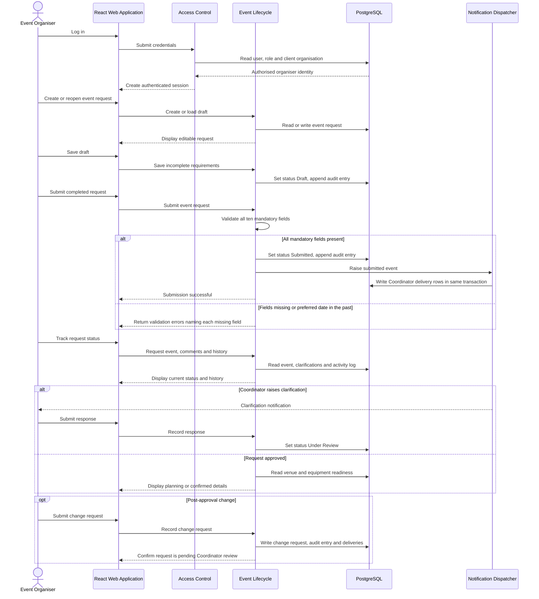
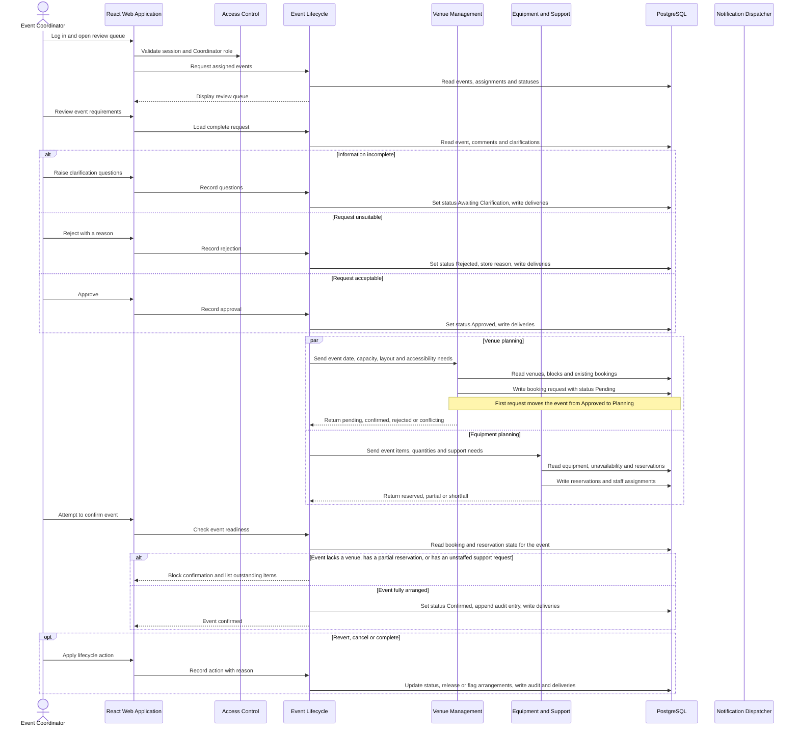
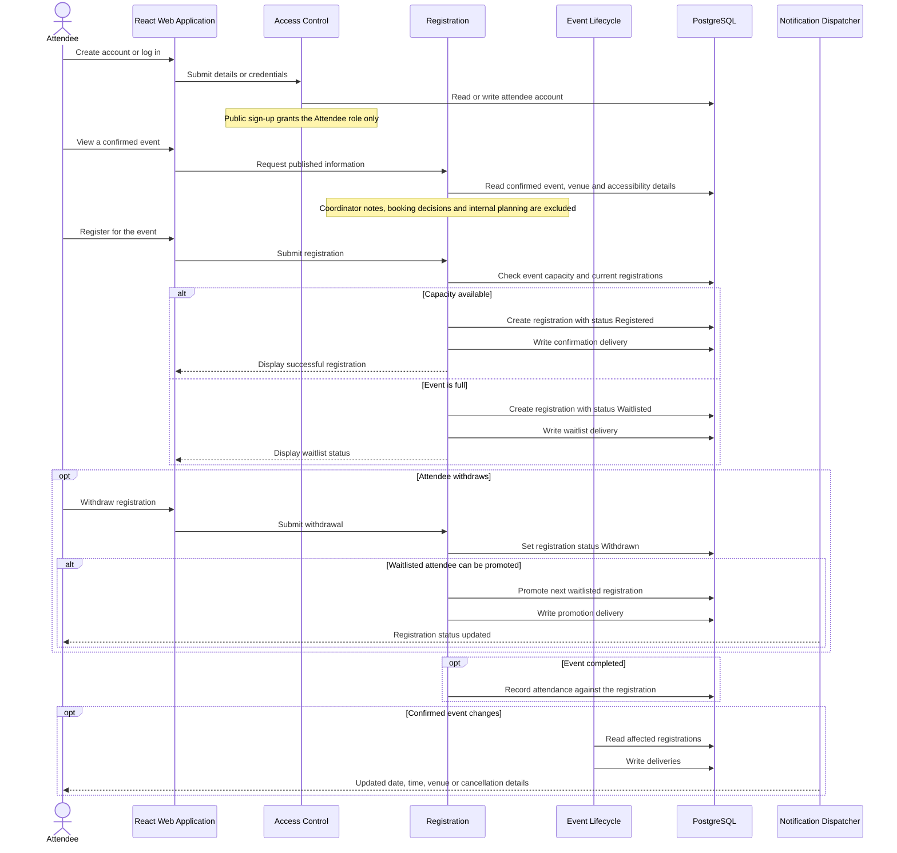

## Architecture Modular Monolith User Flow (Revised)
## 8. Dynamic view — Event Organiser



## 9. Dynamic view — Event Coordinator



## 10. Dynamic view — Venue Staff

```mermaid
sequenceDiagram
    actor VS as Venue Staff
    participant UI as React Web Application
    participant IAM as Access Control
    participant VEN as Venue Management
    participant EVT as Event Lifecycle
    participant DB as PostgreSQL
    participant NOT as Notification Dispatcher

    VS->>UI: Log in
    UI->>IAM: Validate session and Venue Staff role

    VS->>UI: Maintain venue catalogue
    UI->>VEN: Save capacity, layouts, accessibility features and facilities
    VEN->>DB: Write venue, layouts and feature links, append audit entry

    opt Venue unavailable
        VS->>UI: Record maintenance period
        UI->>VEN: Create venue block
        VEN->>DB: Write block
        alt Block overlaps a confirmed booking
            VEN-->>UI: Warn and require conflict to be resolved first
        else No overlap
            VEN->>DB: Write deliveries for affected Coordinators
        end
    end

    VS->>UI: Open a pending booking request
    UI->>VEN: Load event requirements and venue
    VEN->>DB: Read event, requirements and venue state

    VS->>UI: Review suitability and availability
    VEN->>DB: Read capacity, layouts, features, operating hours, blocks and bookings
    Note over VEN: Suitability is advisory; the decision remains with Venue Staff

    alt Approve
        UI->>VEN: Approve booking request
        VEN->>DB: Set booking status Confirmed
        Note over VEN,DB: EXCLUDE constraint rejects overlapping confirmed bookings
        alt Constraint violation, another approval won
            VEN-->>UI: Report that the venue has just been taken
        else Written successfully
            VEN->>DB: Flag competing pending requests as conflicting
            VEN-->>EVT: Return confirmed booking
            VEN->>DB: Write Coordinator deliveries
        end
    else Reject
        UI->>VEN: Reject with reason and optional alternative venue
        VEN->>DB: Set booking status Rejected, store reason and suggestion
        VEN-->>EVT: Return rejection so Coordinator can amend the request
    end
```

## 11. Dynamic view — Technical Support Staff

```mermaid
sequenceDiagram
    actor TS as Technical Support Staff
    participant UI as React Web Application
    participant IAM as Access Control
    participant EQ as Equipment and Support
    participant EVT as Event Lifecycle
    participant DB as PostgreSQL
    participant NOT as Notification Dispatcher

    TS->>UI: Log in
    UI->>IAM: Validate session and Technical Support role

    TS->>UI: Maintain equipment catalogue
    UI->>EQ: Save type, description, quantity, location and operational status
    EQ->>DB: Write equipment, append audit entry

    TS->>UI: Open an equipment request
    UI->>EQ: Load requested items, quantities and event times
    EQ->>DB: Read request and event

    TS->>UI: Check availability
    EQ->>DB: Read total quantity, overlapping reservations and dated unavailability
    Note over EQ: Location does not affect availability; no transit allowance applies

    alt Full quantity available
        TS->>UI: Reserve equipment
        EQ->>DB: Write reservation with status Reserved
        EQ-->>EVT: Return reserved
    else Only part available
        TS->>UI: Record partial reservation
        EQ->>DB: Write reservation with status Partial
        EQ->>DB: Write Coordinator deliveries stating outstanding quantity
        EQ-->>EVT: Return shortfall, which blocks confirmation
    end

    opt Event requested technical support
        TS->>UI: Assign an available colleague
        UI->>EQ: Record assignment
        EQ->>DB: Write assignment
        Note over EQ,DB: EXCLUDE constraint rejects overlapping assignments for the same colleague
    end

    opt Item damaged or entering maintenance
        TS->>UI: Mark item unavailable for a period with a reason
        EQ->>DB: Write dated unavailability row
        EQ->>DB: Flag affected events and write Coordinator deliveries
        Note over EQ,DB: Existing reservations are flagged, never released automatically
    end
```

## 12. Dynamic view — Attendee



## 13. Dynamic view - Event Coordinator Lead (Week 7, C-69)

```mermaid
sequenceDiagram
    actor LD as Event Coordinator Lead
    participant UI as React Web Application
    participant IAM as Access Control
    participant EVT as Event Lifecycle
    participant DB as PostgreSQL
    participant NOT as Notification Dispatcher

    LD->>UI: Log in
    UI->>IAM: Validate session and Lead role
    UI->>EVT: Open unassigned queue
    EVT->>DB: Read events with status Submitted and no coordinator, oldest first
    EVT-->>UI: Queue with basic event information

    LD->>UI: Open a queued request and choose a Coordinator
    UI->>EVT: List Coordinators with active-event counts
    EVT->>DB: Count events per Coordinator in active statuses
    LD->>UI: Assign
    UI->>EVT: Assign Coordinator (E03-S08)
    EVT->>DB: Set coordinator_id and assigned_by, status Under Review, append audit entry
    EVT->>NOT: Notify assigned Coordinator and Organiser
    Note over EVT,DB: Replaces the automatic assignment of E03-S01; same Submitted to Under Review transition

    alt Lead reassigns directly (E03-S09, O-36)
        LD->>UI: Reassign to another Coordinator
        UI->>EVT: Reassign
        EVT->>DB: Replace coordinator_id, set assigned_by, append audit entry
        EVT->>NOT: Notify outgoing and incoming Coordinators and the Organiser
    else Coordinator asked the Lead (O-37)
        EVT->>DB: Read reassignment requests addressed to the Lead
        LD->>UI: Reassign or decline with a note
        EVT->>NOT: Notify the requesting Coordinator
    end

    LD->>UI: Open oversight view (E03-S10)
    UI->>EVT: Read every active event with its Coordinator or Unassigned
    EVT->>DB: Read events in active statuses, including Safety Review
    EVT-->>UI: Assignments, workload per Coordinator, filters
```

## 14. Dynamic view - Safety Officer (Week 7, C-70)

```mermaid
sequenceDiagram
    actor EC as Event Coordinator
    actor SO as Safety Officer
    participant UI as React Web Application
    participant IAM as Access Control
    participant EVT as Event Lifecycle
    participant VEN as Venue Management
    participant EQ as Equipment and Support
    participant DB as PostgreSQL
    participant NOT as Notification Dispatcher

    EC->>UI: Submit event for Operational Safety Check (E08-S03)
    UI->>EVT: Check readiness
    EVT->>VEN: Every venue booking Confirmed or withdrawn, at least one Confirmed
    EVT->>EQ: Equipment fully reserved, technical support assigned
    alt Readiness incomplete
        EVT-->>UI: Blocked, outstanding items listed by venue and item
    else Ready
        EVT->>DB: Status Planning to Safety Review, insert safety_checks row with submitted_at, append audit entry
        EVT->>NOT: Notify Safety Officer and Organiser
    end

    SO->>UI: Log in
    UI->>IAM: Validate session and Safety Officer role
    UI->>EVT: Open safety review queue (E08-S06)
    EVT->>DB: Read events in Safety Review with venues, capacities, layouts, restrictions, attendance, accessibility, equipment
    EVT-->>UI: Queue, oldest first

    SO->>UI: Record each of seven factors as satisfactory or not, with comments
    alt Approve
        SO->>UI: Approve
        UI->>EVT: Record decision approved
        EVT->>DB: Write safety_check_factors, decision, status Safety Review to Confirmed, append audit entry
        EVT->>NOT: Notify Organiser and Coordinator with confirmed details
    else Request changes or reject (reason mandatory, O-41)
        SO->>UI: Request changes or reject with reason
        UI->>EVT: Record decision
        EVT->>DB: Write factors, decision and reason, status Safety Review to Planning, flag affected arrangements, append audit entry
        EVT->>NOT: Notify Coordinator and Organiser with the items
        Note over EVT,DB: The event is never cancelled by a safety decision; the Coordinator reworks and resubmits
    end
```

## 15. Dynamic view - Tentative hold expiry (Week 7, C-68)

```mermaid
sequenceDiagram
    actor EC as Event Coordinator
    actor VS as Venue Staff
    participant UI as React Web Application
    participant VEN as Venue Management
    participant DB as PostgreSQL
    participant REL as Scheduler and Outbox Relay
    participant NOT as Notification Dispatcher

    EC->>UI: Place tentative hold on a free venue (E06-S05)
    UI->>VEN: Hold
    VEN->>DB: Insert booking status Tentative, expires_at = now + 48h (O-31), occupancy_range buffered
    Note over VEN,DB: Exclusion constraint covers Tentative, so an overlapping hold or request is refused

    opt Venue Staff extend the hold (Scenario 8)
        VS->>UI: Set a later expiry
        UI->>VEN: Extend
        VEN->>DB: Update expires_at, append audit entry hold_extended
    end

    loop Each relay poll (ADR-006 amendment, T-69)
        REL->>DB: UPDATE holds SET reminder_sent_at = now WHERE reminder_sent_at IS NULL AND expires_at <= now + 24h RETURNING
        REL->>NOT: Reminder to the Coordinator for each returned hold (Scenario 7)
        REL->>DB: UPDATE holds SET status = Expired WHERE status = Tentative AND expires_at <= now RETURNING
        REL->>DB: Append audit entry hold_expired per row, in the same transaction
        REL->>NOT: Expiry notice to the Coordinator (Scenario 6)
        Note over REL,DB: Status and reminder_sent_at are the idempotency guards; a crashed poll re-run sends nothing twice
    end

    alt Coordinator converts in time (Scenario 3)
        EC->>UI: Submit booking request for the held venue
        UI->>VEN: Convert hold
        VEN->>DB: Status Tentative to Pending, expires_at cleared
    else Hold expired
        EC->>UI: Open the event
        UI->>VEN: Read bookings
        VEN-->>UI: Hold shown as Expired; venue period is Free on the calendar
    end
```
