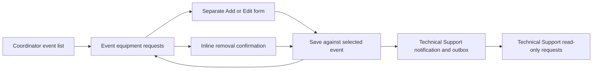

# E07-S02 / SCRUM-52 — Request equipment for an event

Sprint 3, 3 points; Jira accountable owner: Xiang Ying. Implements the canonical
[Release 1 story](../backlog/release-1/E07-equipment-technical-support.md) and
[acceptance cases](../testing/cases/E07.md). The Jira issue was checked at task
start. T-25 was withdrawn by C-62/T-48: separate events have independent equipment
requests. There is no session or event-within-event model; the repeated word
"event" in the backlog/Jira wording does not introduce one.

## Behaviour and API contract

- `GET /api/equipment?mode=requests` lists approved/planning/confirmed events
  assigned to the Coordinator. Technical Support sees events that already have
  equipment requests, including history on completed/cancelled events.
- `GET /api/equipment?mode=requests&event=<id-or-code>` returns the event,
  its requests, active equipment options and `canEdit`.
- `POST` to that event URL accepts `action: saveRequest`, `equipmentId`, a
  positive integer `quantity`, optional `notes` (up to 2000 characters), and
  optional request `id` for amendments. `action: removeRequest` requires `id`.
- Only the active, unlocked assigned Coordinator may mutate requests, while the
  event is Approved or Planning. Technical Support reads requirements without
  Coordinator mutation controls. Wrong roles/assignments are refused and audited;
  invalid identifiers, quantities, retired items and duplicates are rejected.
- Each item is saved separately against its event. Requests for another event
  remain unchanged. Duplicate equipment lines in one event are refused with a
  prompt to edit the existing line.
- Requests above the item's total stock are saved with a warning showing both
  requested and owned quantities. This preserves unmet requirements for review;
  it does not reserve stock or calculate period-based free quantity (E07-S03).
- A request with any reservation history cannot be amended or removed here.
  The reservation workflow (E07-S04) must own changes after reservation; retaining
  those rows also avoids cascading away reservation history.
- Request create/amend/remove and targeted Technical Support notifications with
  email outbox records commit atomically. Delivery failure rolls the request back.
  An unchanged save sends no duplicate notices. Provider delivery itself has not
  been exercised in local validation.

The existing equipment rewrite/function and local dev route are reused. No new
schema, serverless function, dependency or environment variable is introduced.
Event writes serialize on the event row; an equipment row is locked before saving
against current stock/activity. Reservation writers must lock the event, request
and equipment consistently before checking/inserting reservations. E07-S04 must
integrate that protocol; this story does not implement reservations.

### Recipient choice for teammate review

New equipment requirements enter a shared Technical Support department workload
before a technician is assigned. The targeted E07-S02 notice goes to active
`technical_support_staff` accounts; no Venue Staff, Organiser or Attendee notices
are generated. Temporary lockout does not remove notification membership. This
is an implementation interpretation of E07-S02's "Technical Support Staff are
notified", for reviewer approval, not a new accepted customer decision. It does
not change E11-S01's assignment-based routing for general arrangement changes.
If no active Technical Support accounts exist, the requirement still saves and
the Coordinator sees an explicit message that nobody was available to notify.

## Frontend and skeleton alignment

Uses `design.md`, [frontend guide](../frontend-guide.md), ADR-017 and the shared
ListTemplate, DetailTemplate and FormTemplate. Historical Group C/Figma screens
remain design references, not authority over accepted scope. Uses AppShell once,
PageLayout, Card, DataTable, FormSection/FormField/FormActions, ButtonLink,
StatusPill, ConfirmPanel and the shared loading/empty/error states. No feature
stylesheet or new colour/type tokens. Reads use apiCall/useLoad and ignore late
responses; keyed forms and a mounted guard prevent stale save navigation.

| Screen | Route | Skeleton |
| --- | --- | --- |
| Assigned event selector | `/coordinator/equipment-requests` | List with shared DataTable |
| Technical Support requirements list | `/support/equipment-requests` | Read-only list |
| Event request detail | `/coordinator/events/:eventCode/equipment` | Detail with separate Add/Edit navigation and inline remove confirmation |
| Technical Support event detail | `/support/events/:eventCode/equipment` | Read-only detail |
| New request | `/coordinator/events/:eventCode/equipment/new` | Narrow shared form card |
| Edit unreserved request | `/coordinator/events/:eventCode/equipment/:requestId/edit` | Same form with server-authorized values |

Coordinator event detail and the prototype planning workspace link to this live
workflow. Header links are registered in roles.ts. The separate E07-S04 prototype
queue/reservation screens are not presented as completed by this change.

The screen inventory's main-branch snapshot is not marked live before review and
merge. Update its E07-S02 row to these routes when this implementation merges.

## Acceptance traceability

| Acceptance case | Delivered behaviour | Evidence |
| --- | --- | --- |
| TC_E07S02_01 | Microphone x2 and projector x1 saved against one event; staff notices/outbox | equipmentRequests.integration.test.ts and real equipmentRequests auth-e2e journey |
| TC_E07S02_02 | Request 15 against stock 10 persists with numeric stock warning | Same suites plus intercepted desktop/mobile browser warning |
| TC_E07S02_03 | Event B is unaffected by equipment recorded for Event A | Independent rows asserted in PostgreSQL and real browser journey |
| TC_E07S02_04 | Unreserved quantity amended to 3, then line removed; reserved lines protected | Same suites; FK history retained and direct API refusals |
| Access/validation/atomicity | Wrong role/assignment, origin, retired item, duplicates, concurrent create and forced outbox rollback | Backend unit/handler/database and real browser tests |
| Frontend resilience/design | Field error association, read-only controls, protected form, late event response, 320px overflow | Component tests and desktop/mobile Playwright |

## Manual validation walkthrough: expected user-visible results

These are repeatable manual steps, not a claim the user has already performed
all of them. Automated real-stack results and visual inspections have separate
immutable records under `docs/testing/runs/`.

Run the local API and frontend with the ignored local `.env`. Use a seeded
Coordinator account (for example coord_a) and choose an event assigned to that
account in Approved or Planning. Use synthetic test equipment and events. Do not
reset a database to follow these steps. Technical Support's catalogue must contain
an active microphone with stock 10 and an active projector with stock 2.

| Before / setup | User action | Expected after / what the user sees | Manual result |
| --- | --- | --- | --- |
| Event A has no requirements | Open Equipment requests, choose Event A | Event equipment requests with No equipment requested yet and Add equipment request | Pending user execution |
| Event A has no microphone line | Add Wireless Microphone, quantity 2, then save | Microphone row at 2, total stock 10, Not reserved; save acknowledgement and staff notification acknowledgement | Pending user execution |
| Microphone line exists | Add Projector, quantity 1 | Both equipment rows under Event A; neither is a reservation | Pending user execution |
| Microphone stock is 10 | Edit microphone request to 15 and save | Warning: 15 units requested, total stock 10, cannot be met from existing stock; requirement remains saved | Pending user execution |
| Event A has requirements, Event B has none | Open Event B, then return to Event A | Event B remains empty; Event A retains its own rows | Pending user execution |
| Microphone is unreserved | Edit quantity to 3 and add a note; save, refresh | Quantity 3 and the note remain visible | Pending user execution |
| Microphone is unreserved | Remove, confirm, refresh | Microphone row gone; other equipment/events unchanged | Pending user execution |
| Reserved request fixture exists | Open that event, try editing/removing directly | Protected row without actions; direct API returns a refusal; reservation remains | Pending user execution |
| Technical Support account | Open Notifications, open Equipment request updated; then Equipment requests and Event A | Event-specific changed-item notice and read-only requirement list | Pending user execution |
| Wrong Coordinator or role | Open Event A's URL or attempt direct mutation | Access refused; no event requirement changed | Pending user execution |

Actual reservation creation belongs to E07-S04. For the protected-row check,
use a prepared test fixture or the real auth-e2e journey. Record a fresh dated
manual session after running these steps, with actual messages and before/after
values. Do not turn expected results into PASS without observation.

## Delivery checklist and dependency

- [x] Event-scoped request creation with multiple items saved separately.
- [x] Over-total-stock warning while retaining the requested requirement.
- [x] Event isolation and amendment/removal before reservation.
- [x] Atomic Technical Support notification/outbox preparation.
- [x] Backend permissions, validation and reserved/history protection.
- [x] Frontend skeleton/design alignment with responsive and failure states.
- [x] Automated real PostgreSQL and authenticated browser acceptance evidence.
- [x] Traceability regenerated and verification records included.
- [ ] Teammate review of implementation and notification recipient choice.
- [ ] Catalogue dependency PR #214 merged; final main-target PR checks pass.
- [ ] Reviewed merge and Jira Definition of Done reconciliation.

This branch starts from PR #214's catalogue implementation. It must not merge
before that dependency. Jira must not be marked Done solely because local tests
passed. Live email delivery and production deployment are not claimed.

## Observed verification records

- [backend/unit: 267 passed](../testing/runs/20261006-021921-xiangyingg-backend-unit.md)
- [backend/db: 2 passed; TC_E07S01_01–04 and TC_E07S02_01–04](../testing/runs/20261006-021922-xiangyingg-backend-db.md)
- [frontend/vitest: 278 passed](../testing/runs/20261006-021923-xiangyingg-frontend-vitest.md)
- [frontend/e2e: 16 passed desktop/mobile](../testing/runs/20261006-021924-xiangyingg-frontend-e2e.md)
- [frontend/e2e: 2 passed desktop/mobile, all four E07-S02 cases](../testing/runs/20261006-021925-xiangyingg-frontend-e2e.md)
- [full-regression: 240 passed; 340 deliberately skipped scaffold cases](../testing/runs/20261006-021926-xiangyingg-full-regression.md)

`npm run typecheck` and `npm run build` also passed on the same working tree.

Historical execution record filenames were normalized during the main refresh.
Filename seconds distinguish the six records; original frontmatter timestamps
and record contents remain unchanged.
